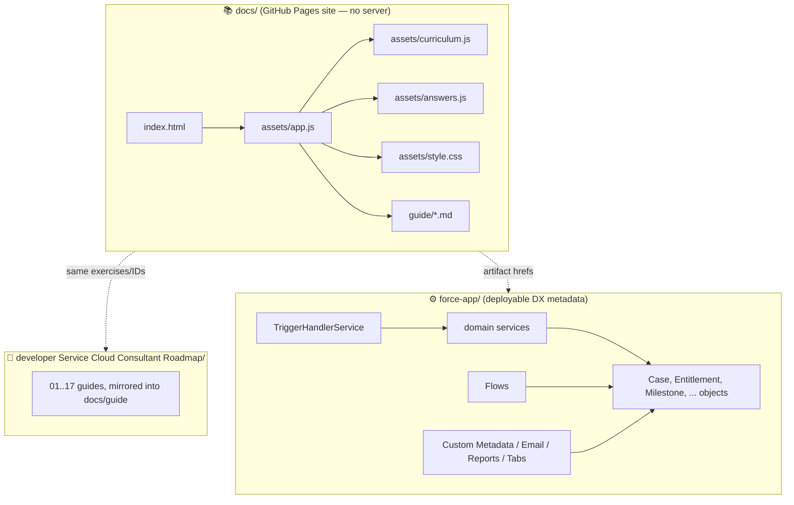
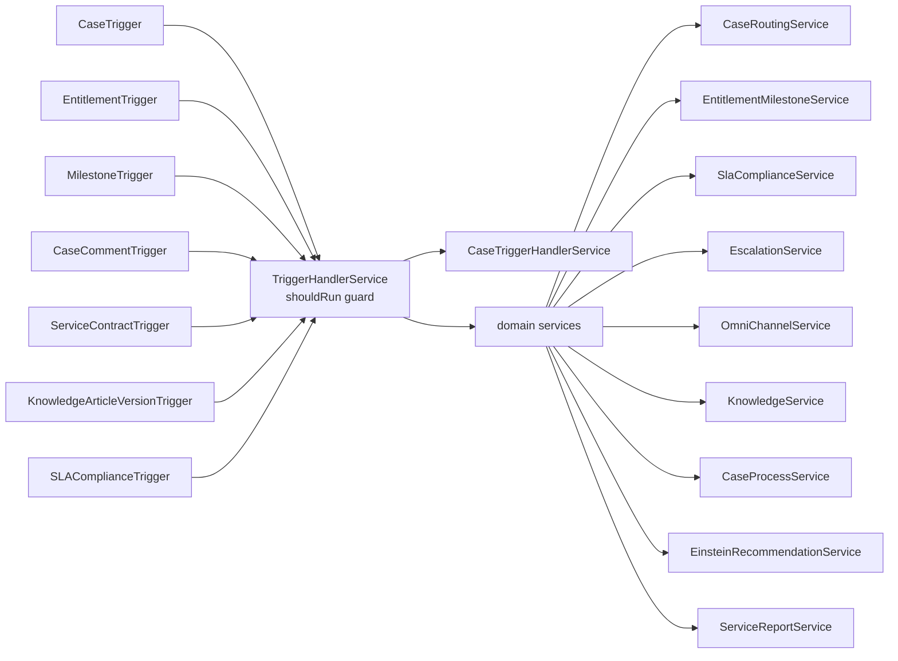
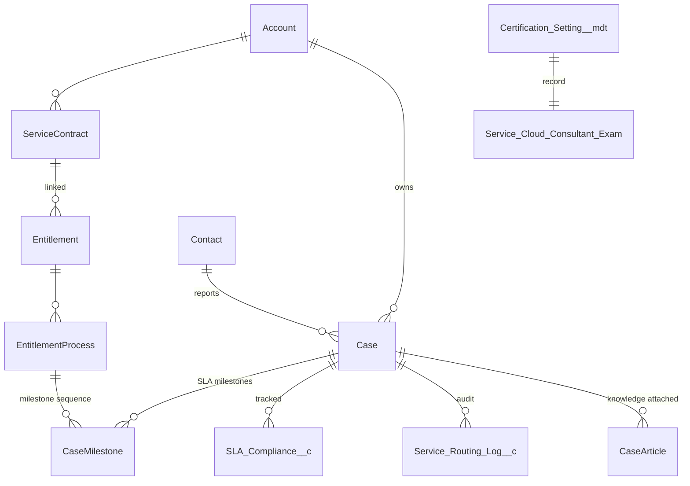
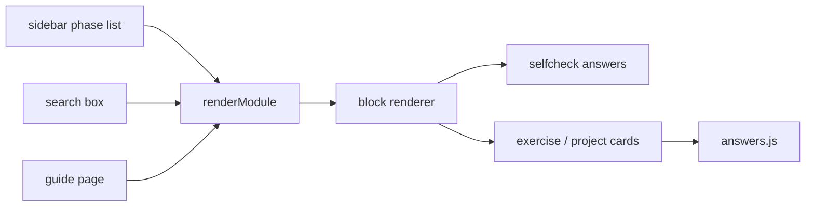
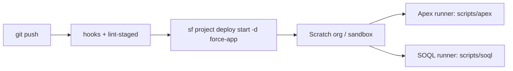

# Architecture — Service Cloud Consultant Roadmap

This learning academy mirrors the reference *Salesforce Dev I & II Roadmap* twin structure: a **deployable Salesforce metadata project** (`force-app`) alongside an **interactive browser site** (`docs/`) that shares the same curriculum and guides.

## 1. High-level layering

**Why twin structure?** You can study purely from the static site with no org, then apply each lesson by deploying the matching metadata into a scratch org. The guide markdown is the canonical source; `docs/` is self-hostable (open `index.html` directly, works over `file://`).

## 2. Salesforce metadata architecture

### 2.1 Service layer (Apex)

All domain logic lives in `with sharing` service classes (bulk-safe, testable, one public method per operation). Triggers stay thin and delegate.

Every service ships with a matching `@isTest` class (`with sharing`, `@TestSetup`, happy path + edge case + bulk (e.g. `List<Case>`) assertions). See `classes/` — `SlaComplianceService.cls`, `KnowledgeService.cls`, etc.

### 2.2 Data model

Custom objects join standard Service Cloud objects to make SLA / routing / training observable.

Objects: `SLA_Compliance__c`, `Service_Routing_Log__c`, `Knowledge_Article_Metrics__c`, `Training_Question__c`, and custom metadata `Certification_Setting__mdt` (schema + `Service_Cloud_Consultant_Exam` record holding the live exam facts). Standard objects are extended with lookup/picklist fields on `Case`, `Account`, `Contact`.

### 2.3 Automation

- **Flows** (6, record-triggered): `Case_Init_Flow` (defaults), `Case_Assignment_Flow` (queue routing), `Case_Escalation_Flow` (time-based escalation), `SLA_Reminder_Flow` (pre-breach warning), `Entitlement_Check_Flow` (VIP/entitlement validation), `Training_Quiz_Scoring_Flow` (scores `Training_Question__c`).
- **Assignment rules**: `Case.assignmentRules` routes cases by criteria.
- **Approval**: `Case.Escalated_Case_Approval` for manager approval on escalations.
- **Platform event**: `Service_Event__e` for notifications/integration entry points.
- **Email**: `Case_Escalation_Notification`, `SLA_Breach_Reminder`.

### 2.4 Reporting

`Service_Cloud_Performance.dashboard` + `Case_SLA_Compliance.report`, `Open_Cases_by_Queue.report` (folders `Service_Cloud_Dashboards`, `Service_Cloud_Analytics`, `Service_Cloud_Templates`).

## 3. Docs site engine

`docs/assets/app.js` (≈921 lines) is a zero-dependency SPA:

- `curriculum.js` → `const GUIDE = ''; const ACADEMY = [ ...17 modules... ]`, module shape `{ id, n, title, icon, color, tagline, guide, art, objectives, lessons, quiz }`.
- `answers.js` → `EXERCISE_ANSWERS` keyed by exercise ID (`14.1`…`14.9`, `MP1`–`MP3`, `CAP`).
- App engine keys: `localStorage['sccacademy-v1']` for progress `{done, quiz, best, stars, guide, lastOpen}`; `localStorage['sccacademy-theme']` for light/dark.
- Guide pages are fetched from `docs/guide/NN-....md` (served by GitHub Pages / any static host). Block renderer supports `p`, `h`, `list`, `num`, `table`, `code`, `callout`, `selfcheck`, `ex`, `proj`.

## 4. CI / developer workflow

- `.husky/pre-commit` → `lint-staged` (prettier + eslint).
- `package.json` scripts: `lint`, `test:unit` (LWC jest), `prettier`, `prettier:verify`.
- Scaffold definition (`config/project-scratch-def.json`) enables `ServiceKnowledge` and `ServiceUser` features so every phase is exercisable end-to-end.

## 5. Guides ↔ metadata traceability

| Phase | Guide | Dotfiles / key artifact |
| --- | --- | --- |
| 2 Case lifecycle | `02-Case-Object-and-Lifecycle.md` | `CaseTrigger`, `CaseProcessService` |
| 4 Entitlements/SLA | `04-Entitlements-Milestones-and-SLA.md` | `EntitlementTrigger`, `MilestoneTrigger`, `EntitlementMilestoneService`, `SlaComplianceService` |
| 5 Automation | `05-Service-Process-Automation.md` | `Case_Assignment_Flow`, `Case_Escalation_Flow` |
| 6 Knowledge | `06-Knowledge-Management.md` | `KnowledgeArticleVersionTrigger`, `KnowledgeService` |
| 8 Omni-Channel | `08-Omni-Channel-and-Omni-Supervisor.md` | `OmniChannelService` |
| 11 Case mgmt best practices | `11-Case-Management-Best-Practices.md` | `CaseCommentTrigger`, `EscalationService` |
| 12 Analytics | `12-Reports-and-Dashboards-for-Service.md` | `ServiceReportService`, `Service_Cloud_Performance.dashboard` |
| 13 Certification prep | `13-Certification-Prep.md` | `Certification_Setting__mdt` + `Service_Cloud_Consultant_Exam` record |
| 14–17 Exercises & use cases | `14..17-*.md` | `answers.js`, `Training_Question__c`, capstones UC1–UC3 |

## 6. Promoting for real-world use

- Swap custom queues in `Case_Assignment_Flow` for values from your org's `Queue` SOQL.
- Extend `EinsteinRecommendationService` with your own `aiPrediction`/Apex AI API calls.
- Harden the approval process + assignment rules for the actual support org rubric (priorities, units, regions).

## 7. Reference this repo

`scripts/apex/*.apex` and `scripts/soql/*.soql` are one-off runners for the lesson demos. The `dev-branch` workflow: scratch org → deploy → run scripts → take the phase quiz on the site → push source only when tests pass.