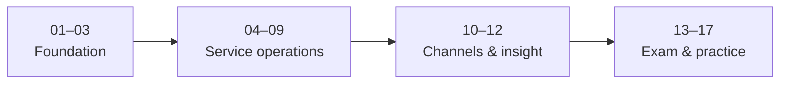
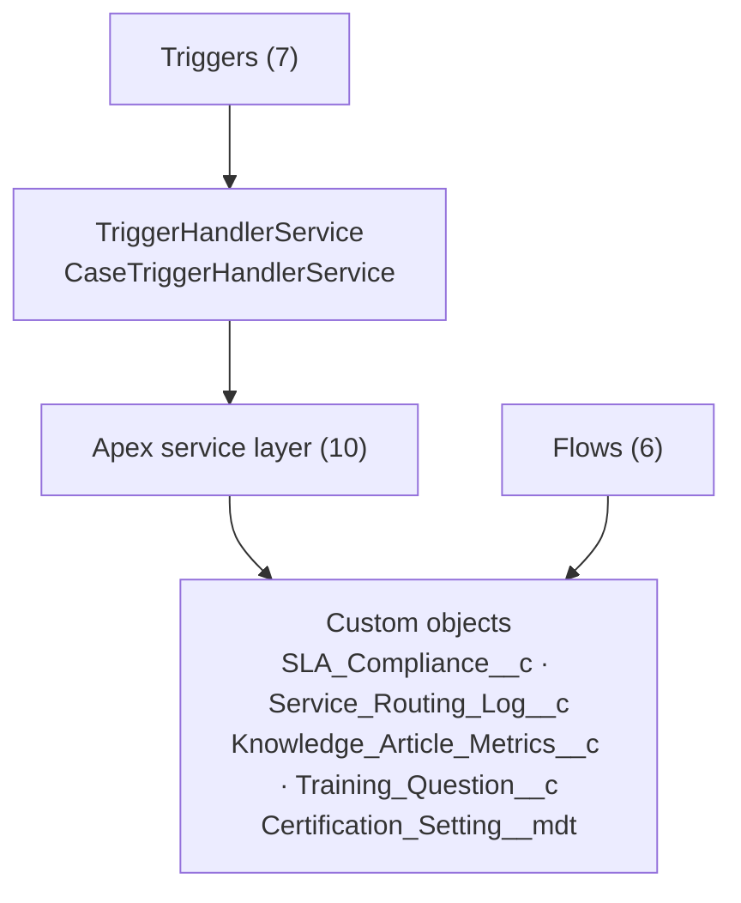

<div align="center">

# Salesforce Service Cloud Consultant Roadmap

**A complete, hands-on academy for the Salesforce Certified Agentforce Service Consultant exam** — 17 guided phases, an interactive study site, and a deployable Salesforce DX lab org.

[](https://abdoaddouli.github.io/Salesforce-Service-Cloud-RoadMap/)

[](#)
[](#the-17-phases)
[](#interactive-study-site)
[](#interactive-study-site)
[](#metadata-in-the-lab-org)
[](#contributing)

</div>

---

## Highlights

| Area | What you get |
| --- | --- |
| **Interactive study site** | 17 phases, 50 lessons and 53 quiz questions with instant feedback, full module guides, bookmarks, notes and progress saved in your browser. Served straight from `docs/` — no build step. |
| **Deployable lab org** | Every component under `force-app/` compiles into a Developer or scratch org: Apex, triggers, flows, objects, reports, dashboards, permissions and more. |
| **17 study guides** | Canonical markdown, rendered in-app and mirrored to `docs/guide/` for GitHub Pages. |
| **Real exam facts as data** | The current blueprint lives in a `Certification_Setting__mdt` record — not only in the docs. |

> **Live site:** <https://abdoaddouli.github.io/Salesforce-Service-Cloud-RoadMap/>
> Prefer offline? Open [`docs/index.html`](docs/index.html) directly in a browser.

## Exam facts (Spring '26)

| Detail | Value |
| :--- | :--- |
| Exam | Salesforce Certified Agentforce Service Consultant (**CRT-150**) |
| Questions | 60 scored + up to 5 unscored |
| Duration | 105 minutes |
| Passing score | 78% (English) · 67% (Japanese) |
| Fee | $200 · retake $100 |
| Prerequisite | Salesforce Certified Platform Administrator |

**Top weighted domains:** Case Management **32%** · Service Cloud Platform 13% · Interaction Channels 11% · Knowledge Management 10% · Contact Center Analytics 9% · Service Cloud Solution Design 9% · Integrations 8% · Service Console 8%.

Full breakdown in [`13-Certification-Prep.md`](developer%20Service%20Cloud%20Consultant%20Roadmap/13-Certification-Prep.md).

## The 17 phases



| # | Phase | Stage |
| :---: | :--- | :--- |
| `01` | Service Cloud Concepts & Architecture | Foundation |
| `02` | The Case Object & Lifecycle | Foundation |
| `03` | Data Model & Relationships for Service | Foundation |
| `04` | Entitlements, Milestones & SLA | Service operations |
| `05` | Service Process Automation | Service operations |
| `06` | Knowledge Management | Service operations |
| `07` | Lightning Service Console | Service operations |
| `08` | Omni-Channel & Omni Supervisor | Service operations |
| `09` | Einstein Bots & Messaging | Service operations |
| `10` | CTI / Open CTI & Telephony | Channels & insight |
| `11` | Case Management Best Practices | Channels & insight |
| `12` | Reports & Dashboards for Service | Channels & insight |
| `13` | Certification Prep | Exam & practice |
| `14` | Practical Exercises & Mini Projects | Exam & practice |
| `15` | Answers & Results | Exam & practice |
| `16` | Real-World Use Cases | Exam & practice |
| `17` | Use Case Solutions | Exam & practice |

<details>
<summary><b>Phase → guide file map</b></summary>

| Phase | Guide |
| :--- | :--- |
| 01 | [`01-Service-Cloud-Concepts-and-Architecture.md`](developer%20Service%20Cloud%20Consultant%20Roadmap/01-Service-Cloud-Concepts-and-Architecture.md) |
| 02 | [`02-Case-Object-and-Lifecycle.md`](developer%20Service%20Cloud%20Consultant%20Roadmap/02-Case-Object-and-Lifecycle.md) |
| 03 | [`03-Data-Model-for-Service.md`](developer%20Service%20Cloud%20Consultant%20Roadmap/03-Data-Model-for-Service.md) |
| 04 | [`04-Entitlements-Milestones-and-SLA.md`](developer%20Service%20Cloud%20Consultant%20Roadmap/04-Entitlements-Milestones-and-SLA.md) |
| 05 | [`05-Service-Process-Automation.md`](developer%20Service%20Cloud%20Consultant%20Roadmap/05-Service-Process-Automation.md) |
| 06 | [`06-Knowledge-Management.md`](developer%20Service%20Cloud%20Consultant%20Roadmap/06-Knowledge-Management.md) |
| 07 | [`07-Lightning-Service-Console.md`](developer%20Service%20Cloud%20Consultant%20Roadmap/07-Lightning-Service-Console.md) |
| 08 | [`08-Omni-Channel-and-Omni-Supervisor.md`](developer%20Service%20Cloud%20Consultant%20Roadmap/08-Omni-Channel-and-Omni-Supervisor.md) |
| 09 | [`09-Einstein-Bots-and-Messaging.md`](developer%20Service%20Cloud%20Consultant%20Roadmap/09-Einstein-Bots-and-Messaging.md) |
| 10 | [`10-CTI-and-Telephony.md`](developer%20Service%20Cloud%20Consultant%20Roadmap/10-CTI-and-Telephony.md) |
| 11 | [`11-Case-Management-Best-Practices.md`](developer%20Service%20Cloud%20Consultant%20Roadmap/11-Case-Management-Best-Practices.md) |
| 12 | [`12-Reports-and-Dashboards-for-Service.md`](developer%20Service%20Cloud%20Consultant%20Roadmap/12-Reports-and-Dashboards-for-Service.md) |
| 13 | [`13-Certification-Prep.md`](developer%20Service%20Cloud%20Consultant%20Roadmap/13-Certification-Prep.md) |
| 14 | [`14-Practical-Exercises-and-Mini-Projects.md`](developer%20Service%20Cloud%20Consultant%20Roadmap/14-Practical-Exercises-and-Mini-Projects.md) |
| 15 | [`15-Answers-and-Results.md`](developer%20Service%20Cloud%20Consultant%20Roadmap/15-Answers-and-Results.md) |
| 16 | [`16-Real-World-Use-Cases.md`](developer%20Service%20Cloud%20Consultant%20Roadmap/16-Real-World-Use-Cases.md) |
| 17 | [`17-Use-Case-Solutions.md`](developer%20Service%20Cloud%20Consultant%20Roadmap/17-Use-Case-Solutions.md) |

</details>

## Interactive study site

The site is a dependency-free single-page app in [`docs/`](docs) — the fastest way to study without an org.

| Feature | Description |
| :--- | :--- |
| **Dashboard** | Roadmap progress ring, units completed, phases mastered, quizzes passed, study-time remaining, and a filterable phase grid. |
| **Lessons** | Bite-sized lessons built from headings, tables, code samples with copy buttons, callouts and "check yourself" prompts. |
| **Full guides** | Every phase's complete markdown guide rendered in-app with a sticky table of contents. |
| **Quizzes** | Instant feedback and explanations, an answered-progress meter, and a **practice-missed** mode to re-try only the wrong questions. |
| **Bookmarks & notes** | Save lessons and attach private notes (autosaved locally). |
| **Command palette** | Press <kbd>/</kbd> to search phases, lessons and quizzes. |
| **Themes** | Dark and light mode. |
| **Progress tools** | Export/import progress as JSON, reset, and a printable certificate at 100%. |

**Keyboard shortcuts**

| Key | Action |
| :--- | :--- |
| <kbd>/</kbd> | Open search |
| <kbd>↑</kbd> / <kbd>↓</kbd> | Navigate results |
| <kbd>Enter</kbd> | Open result |
| <kbd>←</kbd> / <kbd>→</kbd> | Previous / next lesson |
| <kbd>1</kbd>–<kbd>9</kbd> or <kbd>A</kbd>–<kbd>D</kbd> | Answer a quiz question |
| <kbd>B</kbd> | Bookmark the current lesson |
| <kbd>N</kbd> | Toggle notes |

## Repository layout

```
.
├── config/                              # Scratch org definition
├── developer Service Cloud Consultant Roadmap/   # 17 canonical guides (markdown)
├── docs/                                # Interactive GitHub-Pages site
│   ├── index.html                       # Single page app shell
│   ├── guide/                           # Guide mirrors consumed by the site
│   └── assets/                          # app.js · curriculum.js · answers.js · style.css
├── force-app/main/default/
│   ├── classes/                         # 10 service classes + 11 @isTest classes
│   ├── triggers/                        # 7 thin triggers → TriggerHandlerService
│   ├── objects/                         # 5 custom objects (+ Case/Account/Contact extensions)
│   ├── flows/                           # 6 record-triggered flows
│   ├── dashboards/ · reports/           # 1 dashboard + 2 reports
│   ├── email/ · tabs/ · permissionsets/
│   ├── approvalProcesses/ · assignmentRules/ · queues/
│   └── platformEvent/                   # Service_Event__e
├── scripts/                             # apex/ and soql/ sample-data runners
├── manifest/package.xml
├── sfdx-project.json
└── package.json
```

## Metadata in the lab org

<table>
<tr><th align="left">Layer</th><th align="left">Contents</th></tr>
<tr><td><b>Apex</b></td><td>

**10 service classes** — `CaseRoutingService`, `EntitlementMilestoneService`, `SlaComplianceService`, `EscalationService`, `OmniChannelService`, `KnowledgeService`, `CaseProcessService`, `EinsteinRecommendationService`, `ServiceReportService`, `CaseTriggerHandlerService`.

Each ships with a bulk-safe `@isTest` class (`with sharing`, `@TestSetup`), plus `ServiceCloudFundamentalsTest`.

</td></tr>
<tr><td><b>Triggers</b></td><td>

**7 triggers**, all delegating to `TriggerHandlerService` / `CaseTriggerHandlerService`:
`Case`, `Entitlement`, `Milestone`, `ServiceContract`, `CaseComment`, `KnowledgeArticleVersion`, `SLACompliance`.

</td></tr>
<tr><td><b>Flows</b></td><td>

**6 record-triggered flows** — `Case_Init_Flow`, `Case_Assignment_Flow`, `Case_Escalation_Flow`, `SLA_Reminder_Flow`, `Entitlement_Check_Flow`, `Training_Quiz_Scoring_Flow`.

</td></tr>
<tr><td><b>Objects</b></td><td>

**5 custom objects** — `SLA_Compliance__c`, `Service_Routing_Log__c`, `Knowledge_Article_Metrics__c`, `Training_Question__c`, and `Certification_Setting__mdt` (with a `Service_Cloud_Consultant_Exam` record holding the real exam facts above).

</td></tr>
<tr><td><b>Supporting metadata</b></td><td>

Permission set `Service_Cloud_Consultant`, 3 custom tabs, queues, assignment rules, an approval process, 2 email templates, and the `Service_Event__e` platform event.

</td></tr>
</table>

## Quick start

**1 · Study without an org**

```bash
start docs/index.html          # Windows
open  docs/index.html          # macOS
```

**2 · Stand up the lab org**

```bash
sf org create scratch -f config/project-scratch-def.json -a scc-lab \
  --set-default --duration-days 30
sf project deploy start -d force-app
sf org assign permset -n Service_Cloud_Consultant
```

**3 · Load sample data**

```bash
sf apex run --file scripts/apex/case-lifecycle.apex
# scripts/apex/*.apex  · scripts/soql/*.soql
```

Prerequisites follow the exam: create a Platform Developer/Administrator org, enable Service Cloud and Knowledge (the `ServiceKnowledge` and `ServiceUser` features are already in the scratch definition), then work phases 01 → 17.

## Architecture



See [`ARCHITECTURE.md`](ARCHITECTURE.md) for layered diagrams covering the service layer, data-model relationships, trigger→service wiring and the CI workflow.

## Tooling

| Command | Purpose |
| :--- | :--- |
| `npm run prettier` | Format Apex, LWC, XML, JSON, markdown |
| `npm run prettier:verify` | Check formatting without writing |
| `npm run lint` | ESLint over `aura` / `lwc` |
| `npm run test:unit` | LWC Jest unit tests |

A **Husky pre-commit** hook runs `lint-staged` (Prettier + ESLint). Requires **Node ≥ 20** and the **Salesforce CLI** at **API 68.0**.

## Contributing

This project is for learning purposes, and PRs are welcome.
The tests in [`force-app/main/default/classes`](force-app/main/default/classes) keep every service honest, and the guides in [`docs/`](docs) mirror the same exercises. If you improve a lesson or fix a guide, update both the canonical markdown and its `docs/guide/` mirror.
